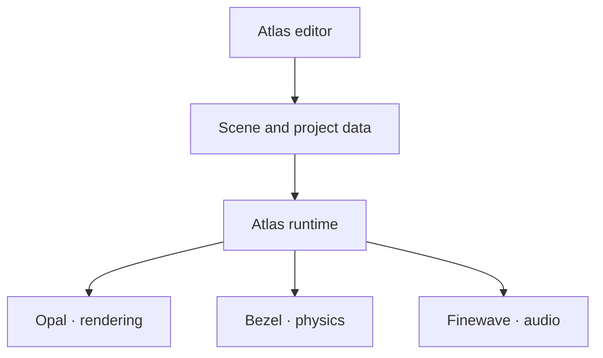

After a year of development, Atlas is entering beta. Welcome to **Atlas Vela**, a new chapter for the engine and the worlds you will build with it.

## A place to create

Atlas brings your project into one workspace. Arrange entities in the scene hierarchy, inspect their properties, edit materials and preview the result in the viewport.

The editor works with the scene data used by the runtime. Your content and the behavior that brings it to life belong to the same project.

## See your world in a different light

Physically based materials and post-processing help shape the look of a scene. Photon brings path tracing and global illumination into the Atlas family, while Aurora and Hydra provide terrain, atmosphere and clouds for the world beyond the viewport.

## A family of focused systems

Atlas is built from modules with clear responsibilities. The editor brings those pieces together without hiding the source behind them.

| System | Responsibility |
| --- | --- |
| Opal | Graphics abstraction |
| Photon | Path tracing and global illumination |
| Aurora and Hydra | Terrain, atmosphere and clouds |
| Bezel | Physics and collision |
| Finewave | Spatial audio |
| Graphite | Interfaces |
| Tracer | Profiling and inspection |

## The journey to beta

From the first pre-alpha renderer to a visual editor and a modular runtime, every release has brought a new part of Atlas into focus. The [Vela release page](/vela1) looks back at that journey, with images from the earliest releases to today.

<Callout title="An engine in development">
Beta is a milestone, and there is still work ahead. Check the notes attached to each download for known issues, available packages and platform support.
</Callout>

## Start your next world

[Get Atlas](/download), explore the [documentation](/learn), or take a look at the [source on GitHub](https://github.com/neutralsoftware/atlas).

We look forward to seeing what you create.
